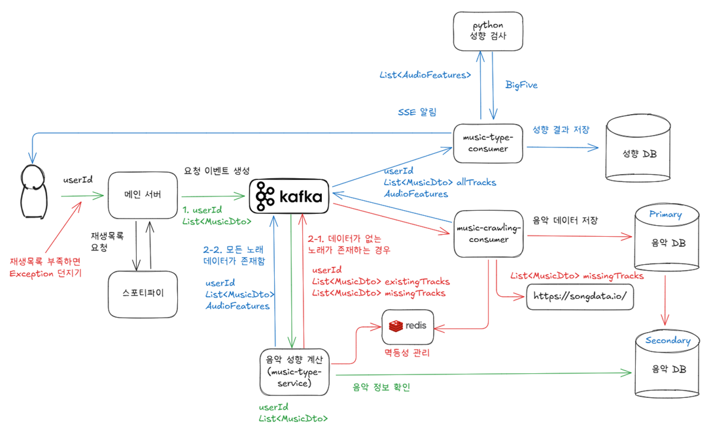

# MusicNote
<br/>
## 프로젝트 소개
- 당신이 듣는 음악이 당신을 말하다. 유저들이 들은 음악을 바탕으로 사람들의 성향을 분석하고, 성향에 어울리는 크로스 도메인을 추천하는 프로젝트입니다.

### 배경 소개
- 삼성소프트웨어 아카데미 특화 프로젝트로 진행된 프로젝트로, 2025년 3월 3일부터 4월 11일까지 6주 간 진행된 프로젝트입니다.
- 6명이 진행하였으며, 프론트엔더 2명, 백엔더 4명(빅데이터 담당 2명, DB담당 프론트 소통 2명)으로 진행했습니다.

### 배포 주소
- 25년 4월 18일까지 유효합니다.
- [배포주소](http://j12a308.p.ssafy.io/) 

## 주요 기능
1. Spotify API를 활용하여 최근 들은 음악을 기준으로 성향을 분석합니다.
2. 분석한 성향 (Big Five 기반)을 일간, 주간 기준으로 레포트를 제공합니다.
3. 분석한 성향을 바탕으로 유저가 좋아할만한 영화와 음악을 추천합니다.

## 시스템 구성도


## 기술 스택
### Frontend
- React
- TypeScript
- Tailwind.css

### Backend
- Java 17, Spring Boot
- Redis, Kafka 3.7 (KRaft 기반)
- MySQL, MongoDB

### DataAnalysis
- Fast API
- Pytorch
- scikit-learn

## 팀원 소개
- 프론트엔드: 민경현, 주현호
- 백엔드(서버): 문인규, 손승범
- 백엔드(데이터분석): 남기운, 윤상흠

## 개발 규칙
### Branch Convention
```
master  
└dev  
└front  
  └fe/feat/signup  
└backend  
  └be/auth/feat/signup  
  └be/music/feat/  
└data  
  └da/feat/charecter  
```

### Commit Convention
```
feat : 기능 추가
style : CSS 디자인 추가, 수정
fix : 에러 수정, 버그 수정
docs : README, 문서
refactor : 코드 리펙토링 (기능 변경 없이 코드만 수정할 때)
modify : 코드 수정 (기능의 변화가 있을 때)
chore : gradle 세팅, 빌드 업무 수정, 패키지 매니저 수정
ex) feat user api 구현
```

## 트러블 슈팅
### Back-End (Server)
#### 1. 사용자의 성향 분석 요청 처리하기

- **문제 상황**
    - 성향 분석 요청은 **여러 서비스에 걸쳐 동작**하므로, 이를 동기적으로 처리할 경우 다음과 같은 문제가 발생할 수 있습니다.
        - 하나의 서비스가 **느리거나 실패하면 전체 처리 지연 또는 실패**
        - **높은 트래픽 발생 시**, 서버가 모든 요청을 실시간으로 처리하기 어려움
        - 서비스 간 **강한 결합도**로 인해 **유지보수 및 확장성 저하**
- **문제 해결**
    - **Kafka 기반 비동기 이벤트 스트리밍 구조**로 설계
    - **메인 서버는 사용자 요청을 Kafka 이벤트로 발행**만 하고, 이후 처리는 각 서비스가 **독립적으로 수행**
    - `music-crawling-consumer`, `music-type-consumer` 등이 **Kafka 메시지를 수신해 병렬 처리**
    - **Redis를 통해 멱등성 관리**, 크롤링 API 호출 및 DB 저장 시 **중복 요청 방지**
    - **SSE(Server-Sent Events)를 통해 사용자에게 비동기 알림 제공**
    - 음악 정보 저장 및 조회 시 **Primary/Secondary DB 분리 사용**
        - `music-crawling-consumer`는 **Primary DB에 쓰기**
        - `music-type-service`는 **Secondary DB에서 읽기**
        - **쓰기/읽기 부하 분산**으로 **데이터 처리 효율성 향상**
        - **Secondary DB는 Primary DB에서 주기적으로 복제**, 데이터 일관성 유지
- **결과**
    - **서비스가 비동기적으로 동작**하여, **처리 지연 및 실패 영향 최소화**
    - **높은 트래픽 상황에서도 안정적인 성능 유지**
    - Kafka 토픽에 **새로운 컨슈머 또는 기능을 쉽게 추가** 가능 → **확장 용이**
    - **낮은 서비스 결합도**로 인해 **수정 및 유지보수 용이**
    - **DB 읽기/쓰기 분리**로 병목 없이 **데이터 처리 가능**
- **추가 고려사항**
    - `music-crawling-consumer`의 **외부 API 호출 지연 시간(약 3초)** 으로 인해 병목 발생 가능
        
        → **컨슈머 인스턴스를 (scale-out)** 하여 **병렬 처리량 증가**
        
    - 단, 인스턴스 수 증가 시 **Primary DB 읽기 부하 증가**
        
        → **Primary DB를 샤딩(sharding)** 하여 **병렬 분산 읽기 구조**로 설계 시 **전체 시스템 성능 향상**


